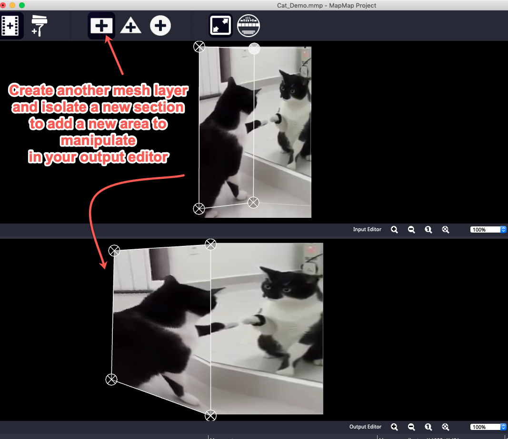

# Projection Mapping

### What is it? 
**Resources** 
Visit [projection-mapping.org](http://projection-mapping.org) for full descriptions of available programs and general news from this field. 

### Free Projection Mapping Program Learning Curve  
These are the programs I know. There are many more with descriptions listed on [projection-mapping.org here](http://projection-mapping.org/software/).

* **MapMap** Free, open source video projection mapping software. Easy to learn and generally ready to go right from the beginning. [Download here](https://mapmapteam.github.io//)
* **VPT** Video Projection Tool- Free, open source video projection mapping software. I think of it as one step up from map map in terms of complexity. [Download here](https://hcgilje.wordpress.com/vpt/).
* **Touch Designer** Also free and open source. Much more complex and powerful than the programs above. We could devote a whole class to this. [Download here](http://www.derivative.ca/) If you are serious about projection mapping and/or augmented reality installations, this is a great program to learn and [you can learn on your own here](https://www.lynda.com/course-tutorials/Learn-TouchDesigner/513599-2.html?srchtrk=index%3a1%0alinktypeid%3a2%0aq%3atouch+designer%0apage%3a1%0as%3arelevance%0asa%3atrue%0aproducttypeid%3a2). 

### Considerations- There are two approaches: 

* Mathematically- considering measurements of surface, distance from surface, and aspect ratio of videos and projector

* Trial and error- when you are able to troubleshoot onsite, this is ideal. And will potentially save you unnecessary effort trying to mathematically calculate the space. 

### Mapmap Tour

